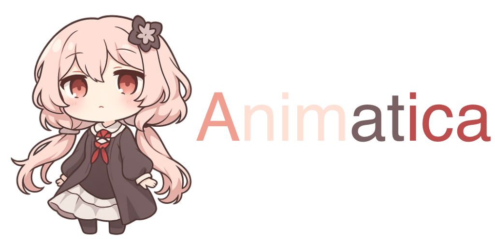

 

## About the project

Animatica is an animation program that plays GIF animations on top of other windows.

The mechanics of this program are interestingly constructed:
The events of opening and closing the application were rewritten to an animation step forward or backward.

